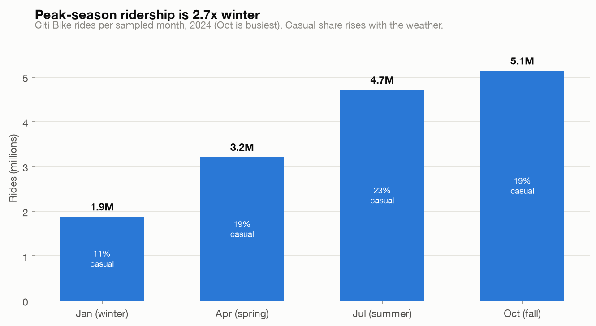
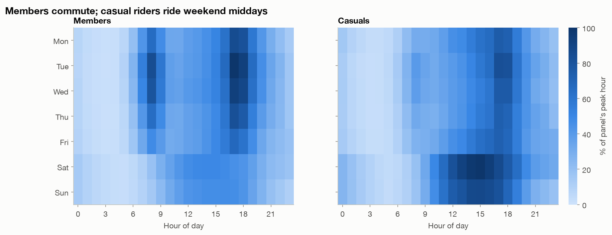
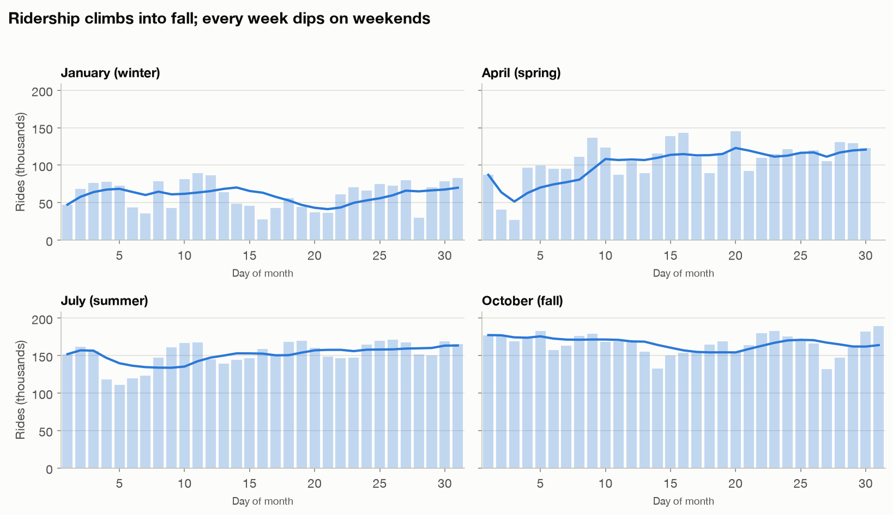
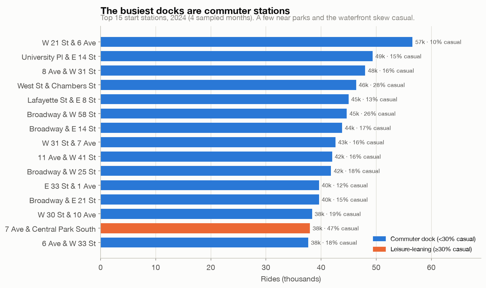

# Findings: Citi Bike demand patterns, 2024

## Question
How does Citi Bike demand move across seasons, days of the week, and hours of the
day, and how do annual members differ from casual riders? The point is operational:
when and where are bikes actually needed, and who is worth converting to membership?

## Data and method
14,972,591 clean rides from four months of 2024 (January, April, July, October), one
per season (see [`data/README.md`](data/README.md) for why four months rather than the
full year). Loaded with `LOAD DATA LOCAL INFILE`, cleaned in SQL: removed 3,664 rides
over 24 hours and a small number of invalid rows, kept 10,880 dockless pickups as NULL
stations. Time-of-day, weekday, and month fields are generated columns so every query
groups on one shared definition.

## What the data shows

### 1. Ridership more than doubles from winter to fall

October was the busiest sampled month at 5.1M rides, 2.7× January's 1.9M. Casual
riders are a bigger share when the weather is good, rising from 11% of January rides
to 23% of July's. The annual member base is steadier; casual demand is what swings
with the season. (October edging out July is specific to 2024's weather; four months
can't pin the exact annual peak. See caveats.)

### 2. Members commute, casual riders take weekend trips

Members show the commuter signature: a sharp weekday double-peak around 8am
and 5–6pm (the evening peak hits ~949k rides in the sampled data, the morning ~757k),
fading on weekends. Casual riders invert it. Their demand concentrates on weekend
middays. These are two different products on one bike fleet.

The behavioral summary backs it up:

| | Members | Casual |
|---|---:|---:|
| Share of rides | 80.8% | 19.2% |
| Average trip | 11.4 min | 20.4 min |
| Weekend share | 22.3% | 34.3% |
| Electric-bike share | 64.6% | 72.0% |

Casual trips run nearly twice as long, lean to weekends, and use e-bikes more.

### 3. Daily demand climbs into fall, and dips every weekend

The 7-day average (bold) rises across the year from roughly 60k rides/day in January
to about 170k in October. Within every month the raw daily counts sawtooth downward on
weekends. The weekday commute is the base load, consistent with members being 80% of
rides.

### 4. The busiest stations are commuter docks

The top 15 start stations sit in Midtown and around transit hubs (W 21 St & 6 Ave
leads at ~57k), and they are mostly member-driven, most at 10–18% casual.
The exception is 7 Ave & Central Park South at 47% casual with a 25-minute average
trip: a leisure and tourist dock rather than a commuter one.

## Caveats and limitations
- **Four months, not a continuous year.** Seasonality here is a four-season
  comparison. Month-to-month transitions are not visible, and October beating July
  reflects 2024's weather; a different year could peak in a different month.
- **No weather data.** The seasonal pattern lines up with temperature, but weather
  isn't joined in, so the link is inferred, not measured.
- **Trip starts, not met demand.** Counts are rides that happened. A station that is
  empty at 8am shows low ridership whether demand was low or the bikes were gone.
  Rebalancing and supply are not modeled, so these numbers understate demand at
  supply-constrained docks.
- **Member/casual is a plan type,** not directly "resident vs tourist." The leisure
  vs commute reading is a reasonable inference from the timing and trip length, not a
  labeled fact about who the riders are.
- **One city, one year, observational.** Patterns describe NYC in 2024 and should not
  be projected onto other systems or years without checking.

## Recommendation
Run operations against two demand curves rather than one. On weekdays, rebalancing
should track the member commute: bikes toward business districts before the 8am peak,
back toward residential areas before the evening peak. On weekends, shift toward the
leisure corridors near parks and the waterfront where casual demand concentrates.
Scale seasonal bike supply and staffing roughly 2.7× from the winter trough to the
fall peak, and plan the annual capacity peak for early fall instead of mid-summer.
Casual riders (longer trips, weekend-heavy, higher e-bike use) are the natural
membership conversion target; leisure-heavy stations like Central Park South are where
to reach them.
