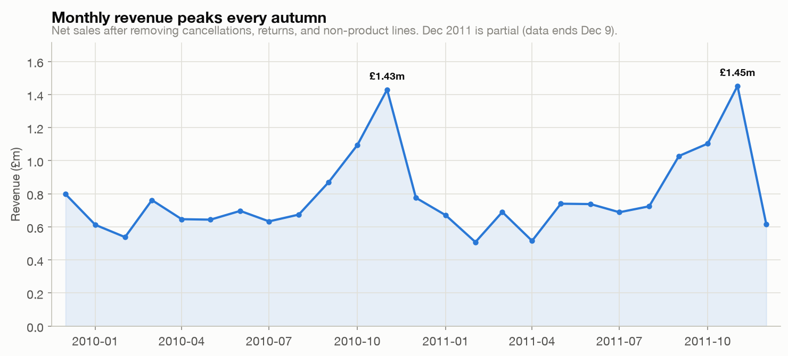
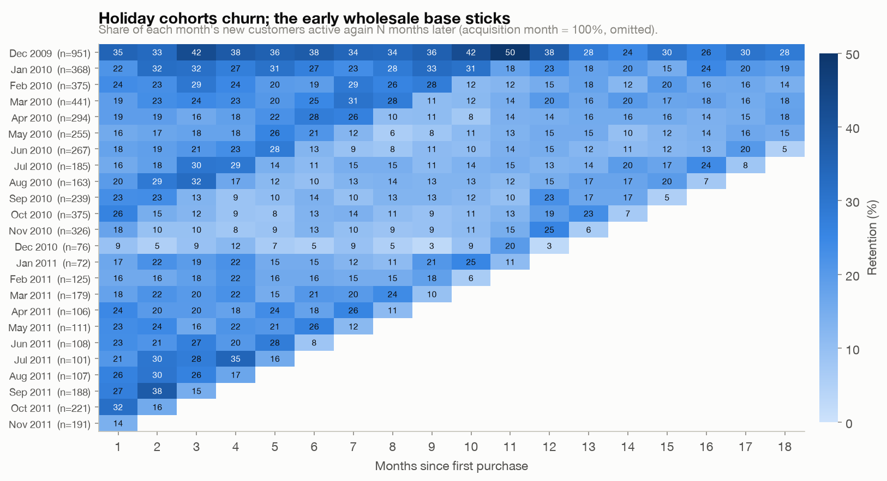
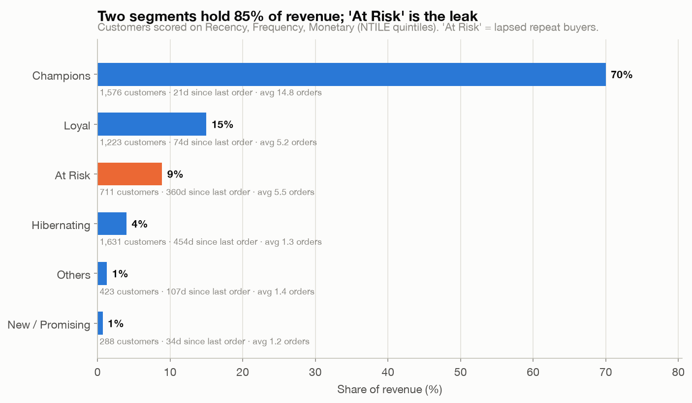
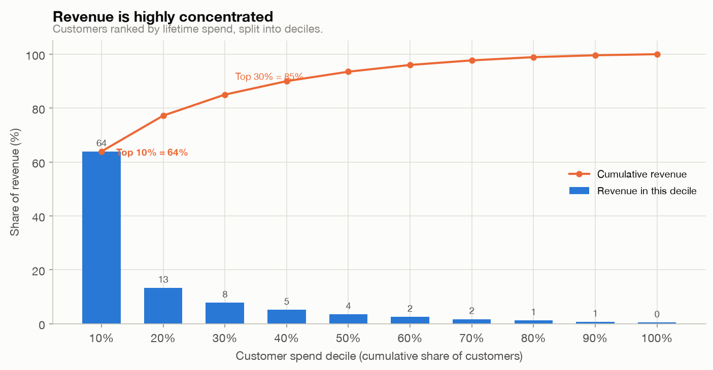

# Findings — customer retention and value, Online Retail II

## Question
The business runs on repeat buyers, but which ones, and where does the retention
leak? Specifically: how do acquisition cohorts retain over time, which customer
segments hold the revenue, and who is worth trying to win back?

## Data and method
Transaction records for a UK online gift retailer, Dec 2009 to Dec 2011 (UCI
Online Retail II, 1,067,371 rows). Cleaning (`sql/02_load_and_clean.sql`) removed
19,494 cancellations, 3,457 non-positive quantities, 2,768 non-positive prices,
4,775 service/adjustment line items (POST, AMAZONFEE, BANK CHARGES, and similar),
and about 33,667 exact duplicate rows. That leaves 1,003,210 clean line items and
£19.64M in net revenue.

Revenue totals use all clean sales. Customer-level work (cohorts, RFM, repeat
behavior) uses only the 776,573 lines that carry a customer ID; 22.8% of raw lines
have none and cannot be attributed to a customer. 5,852 identified customers have a
valid first purchase.

## What the data shows

### 1. Revenue is seasonal, peaking every autumn

Revenue climbs from late summer to a November peak both years (£1.43M in Nov 2010,
£1.45M in Nov 2011), then falls back in the new year. December 2011 looks like a
collapse only because the data stops on the 9th. The pattern is a gift retailer's
holiday cycle, and it matters for the cohort read below: customers acquired in the
November rush behave differently from the rest.

### 2. Holiday cohorts churn; the core base is stickier

Each row is the customers who first bought in that month; each cell is the share
active again N months later. The November 2010 cohort drops to 8–13% within a few
months and mostly stays there. Spring and summer cohorts hold noticeably better.
Most cohorts show a bump around month 12, the seasonal repurchase a year after a
first holiday order.

The December 2009 row sits much higher (33–42%), but that is partly an artifact:
December 2009 is the first month in the data, so long-standing customers who were
already active appear as brand-new here (left-censoring). Read it as an upper
bound, not as evidence that early customers were unusually loyal. The reliable
signal is the contrast between November holiday cohorts and the rest.

### 3. Two segments hold 85% of revenue; one is leaking

Scoring every customer on Recency, Frequency, and Monetary value (quintiles):
Champions (1,576 customers) and Loyal (1,223) together account for 85% of revenue.
The segment worth acting on is **At Risk**: 711 customers who bought 5.5 times on
average but have not returned in about a year. They contributed £1.5M and are
sliding toward Hibernating, the 1,631 mostly one-time buyers who account for 4%.

### 4. The business is repeat buyers, and revenue is concentrated

Repeat buyers are 72% of identified customers and **96.7% of revenue**; one-time
buyers, 28% of customers, bring 3.3%. When repeat buyers return, the second order
takes about 99 days on average. Spend is concentrated on top of that: the top 10%
of customers account for 64% of revenue, the top 30% for 85%.

## Caveats and limitations
- **Left-censoring** inflates the December 2009 cohort, as noted. Cohort comparisons
  within 2010–2011 are sound; comparisons against the first month are not.
- **Missing customer IDs.** 22.8% of lines have no customer. Customer-level findings
  describe identified customers only, and would shift if the unattributed sales
  skew toward one behavior.
- **Wholesale skew.** This retailer sells largely to wholesale buyers, so monetary
  values are long-tailed and the Champions segment is dominated by bulk purchasers.
  The concentration figures reflect a B2B-leaning base, not typical consumer retail.
- **One retailer, one period, observational.** No control group, no marketing spend,
  no channel. These are associations, not causal effects, and they may not generalize
  beyond this business or the 2009–2011 window.
- **Segment boundaries are a convention.** RFM quintiles and the segment rules are a
  modeling choice; the cutoffs are defensible, not ground truth.
- **Recency is measured at a fixed snapshot** (the day after the last transaction).
  "360 days since last order" is relative to that frozen date.

## Recommendation
Prioritize the At Risk segment. These are 711 proven repeat buyers, worth £1.5M
historically, who lapsed but have not yet gone cold. Winning back even a fraction is
cheaper than the near-impossible task of converting one-time holiday buyers, who
churn hard and contribute little. Two supporting moves: because the second purchase
takes about 99 days, a reactivation nudge in the 45–75 day window after a first order
targets the one-time-to-repeat gap directly; and because the top 10% of customers
carry 64% of revenue, that group warrants deliberate account retention rather than
being left to churn silently.
