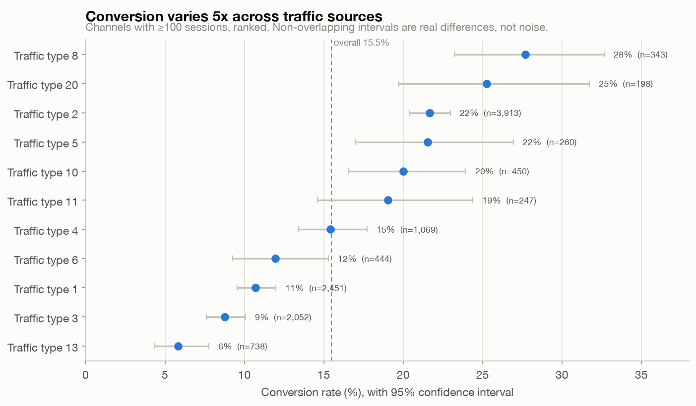
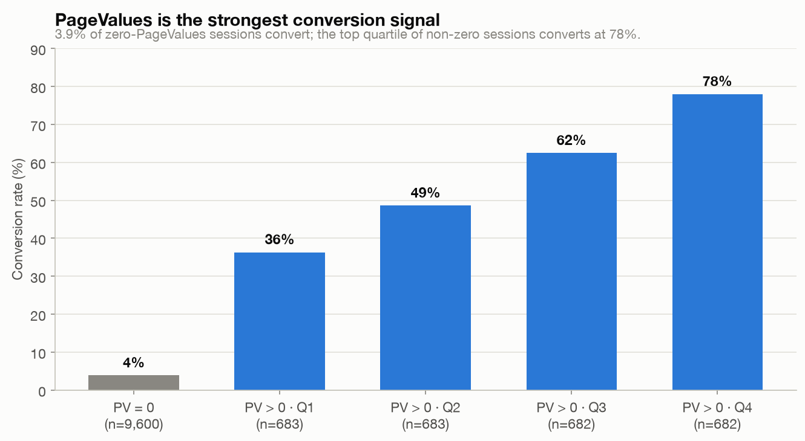

# Conversion funnel and segments — Online Shoppers Intention

**Question:** Of 12,330 e-commerce sessions, where do the 84.5% that don't buy fall
away, and which visitors, channels, and behaviors convert best?

**Headline:** The split between a 4% and a 56% session is whether it reaches a page with
value. New visitors convert nearly 2× returning ones (with non-overlapping confidence
intervals), conversion varies 5× across traffic sources, and it peaks at 25% in November.

## Dataset
- **Online Shoppers Purchasing Intention**, UCI ([dataset 468](https://archive.ics.uci.edu/dataset/468/online+shoppers+purchasing+intention+dataset)), CC BY 4.0.
- 12,330 sessions, 17 features, boolean purchase target; 15.5% overall conversion.
- Source, license, framing, and reproduction: [`data/README.md`](data/README.md).

## Approach
1. **Load** the CSV into a staging table and **clean** in SQL ([`sql/02_load_and_clean.sql`](sql/02_load_and_clean.sql)): cast TRUE/FALSE to 0/1, normalize the `June`/`Jun` month, keep the 125 duplicate rows deliberately.
2. **Analyze** — one question per file:
   - [`03_engagement_funnel.sql`](sql/03_engagement_funnel.sql) — conversion by engagement stage
   - [`04_conversion_by_visitor_type.sql`](sql/04_conversion_by_visitor_type.sql) — new vs returning, with Wilson 95% CIs
   - [`05_conversion_by_traffic_type.sql`](sql/05_conversion_by_traffic_type.sql) — channels ranked, with CIs
   - [`06_pagevalues_effect.sql`](sql/06_pagevalues_effect.sql) — conversion across PageValues quartiles
   - [`07_conversion_by_month.sql`](sql/07_conversion_by_month.sql) — seasonality and SpecialDay
3. **Chart** from live query output ([`analysis/`](analysis)) → [`assets/`](assets).

MySQL 8.0 syntax on MySQL 9.7.1. Conversion rates carry Wilson confidence intervals
computed in SQL. Window functions used for group shares, ranking, and the NTILE
quartiles.

## Key findings

Conversion by traffic source, with 95% confidence intervals — the spread is real, not noise.



PageValues sorts sessions from 4% to 78%, though it is partly a reflection of the outcome.



Full writeup, the funnel and monthly charts, the statistical caveats, and the
recommendation: [`findings.md`](findings.md).

## Caveats (short version)
Sessions, not users, so the funnel is engineered, not a click path. PageValues is partly
a consequence of converting, so it describes converting sessions more than it predicts
them. Channels are anonymized codes. One site, one year, no Jan/Apr. Full list in
[`findings.md`](findings.md#caveats-and-limitations).

## Reproduce
```bash
# from the repo root, venv active, db.local.cnf in place, local_infile=1
# (download the CSV first — see data/README.md)
mysql --defaults-extra-file=db.local.cnf < shopper-conversion-funnel/sql/01_schema.sql
mysql --defaults-extra-file=db.local.cnf --local-infile=1 < shopper-conversion-funnel/sql/02_load_and_clean.sql
for f in shopper-conversion-funnel/analysis/plot_*.py; do python "$f"; done
```
