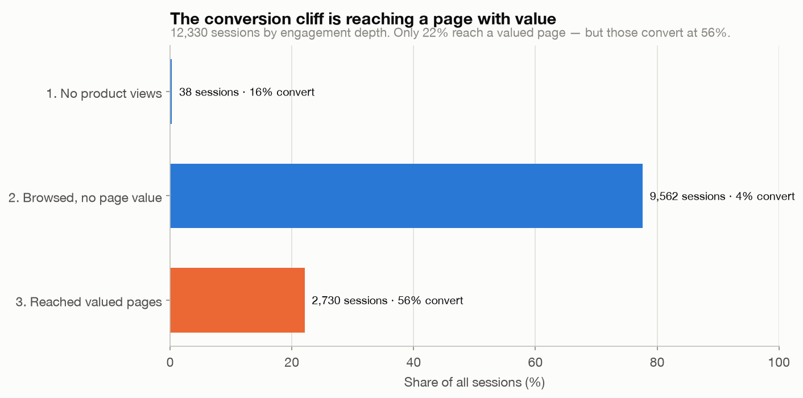
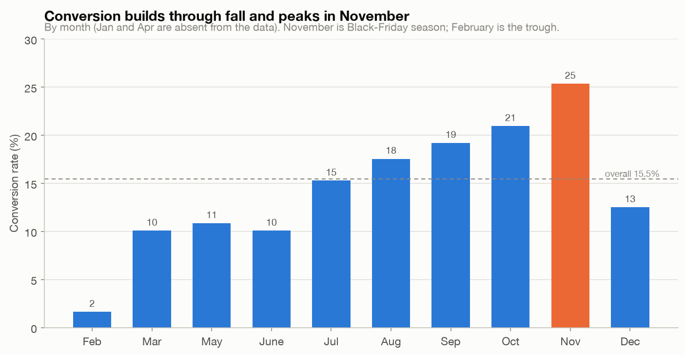

# Findings: where e-commerce sessions convert, Online Shoppers Intention

## Question
Of 12,330 browsing sessions, 15.5% ended in a purchase. Where do the other 84.5%
fall away, which visitor types and traffic sources convert best, and what separates a
converting session from a bouncing one?

## Data and method
One year of sessions from an e-commerce site (UCI Online Shoppers Intention). Each row
is one session summarized as Google-Analytics-style metrics, cleaned in SQL (see
[`data/README.md`](data/README.md)): booleans cast to 0/1, the `June`/`Jun` month
inconsistency normalized, 125 exact-duplicate rows kept on purpose. Conversion rates
carry Wilson 95% confidence intervals so differences between groups can be judged
against sampling noise rather than eyeballed.

## What the data shows

### 1. The drop-off is about reaching a page with value

Split sessions by how far they engage: 77.6% browse product pages but never reach a
page with any PageValue, and they convert at 3.8%. The 22.1% that do reach a valued
page convert at 56.3%. Getting a session to a page the site has assigned value to is
the difference between a 4% and a 56% outcome. (Read the direction of that with the
caveat below. PageValues is partly a consequence of converting, not only a cause.)

### 2. New visitors convert nearly twice as often as returning ones
| Visitor type | Sessions | Conversion | 95% CI |
|---|---:|---:|---|
| New | 1,694 | 24.9% | 22.9–27.0% |
| Other | 85 | 18.8% | 11.9–28.4% |
| Returning | 10,551 | 13.9% | 13.3–14.6% |

New visitors convert at 24.9% against returning visitors' 13.9%, and the confidence
intervals don't overlap, so the gap is real rather than noise. It is also
counterintuitive, and probably says more about who arrives as a "new" session (often
intent-driven, campaign-driven first visits) than about newness itself. It is a
correlation worth investigating, not a reason to stop marketing to returning customers.

### 3. Conversion varies fivefold across traffic sources

Among channels with enough volume to rank, conversion runs from 5.8% (traffic type 13)
to 27.7% (traffic type 8). The largest channel, type 2, brings 3,913 sessions at 21.7%,
comfortably above the 15.5% site average. The channels are anonymized integer codes, so
this ranks them without naming them, but the spread is large and, for the well-separated
pairs, statistically clear.

### 4. PageValues sorts sessions almost perfectly, with a catch

Sessions with PageValues of zero (78% of all sessions) convert at 3.9%. Among the rest,
conversion climbs monotonically across quartiles: 36%, 49%, 62%, 78%. This is the
sharpest separator in the dataset. The catch is in the caveats: PageValues is a
Google Analytics metric that credits pages along the path to a transaction, so a
converting session tends to accrue PageValues *because* it converted. It is closer to a
mirror of the outcome than to an independent early signal.

### 5. Conversion builds through fall and peaks in November

Conversion climbs from single digits in spring to 25.4% in November (the Black Friday
window), then falls back in December. February is the trough at 1.6%. The dataset has no
January or April rows, so the curve has gaps. Weekend sessions convert a little higher
than weekday (17.4% vs 14.9%). One non-result worth stating: the `SpecialDay` feature,
which measures closeness to holidays like Valentine's and Mother's Day, is nonzero only
in February and May (the two lowest-converting months), so as encoded it does not track
conversion at all.

## Caveats and limitations
- **PageValues is partly an outcome, not a clean predictor.** It is computed from the
  value of pages visited on the way to a transaction, so it partly reflects that the
  purchase happened. Treat findings 1 and 4 as description of what converting sessions
  look like, not as a lever you can pull to manufacture conversions.
- **Sessions, not users, and not an event stream.** The funnel is engineered from
  session-level page counts. It is not a per-user, step-by-step click path.
- **Anonymized codes.** Traffic source, OS, browser, and region are integers with no
  published key, so segments can be ranked but not named.
- **Missing months and one site, one year.** No January or April; a single retailer;
  observational data. No causal claims, and patterns may not generalize.
- **New-vs-returning is likely confounded** by how those sessions arrive. The
  association is real; the mechanism is not established here.

## Recommendation
Work the two things that are both real and actionable: channel and timing. Shift
acquisition budget toward the high-converting sources (traffic types 8, 20, and the
high-volume type 2) and away from the 6–9% laggards, and weight campaigns toward the
fall run-up to November. Treat the new-visitor conversion advantage as a lead to chase.
Find out which channels produce those first-visit conversions and whether the returning-
visitor experience is leaking otherwise-loyal customers. Do not build a strategy around
raising PageValues or around SpecialDay: the first is largely a reflection of conversion
already happening, and the second doesn't move with conversion in this data.
